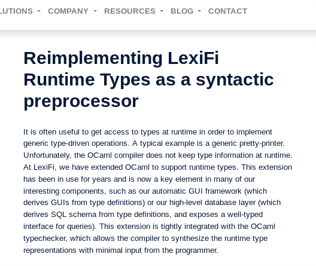

## First Contact

```ocaml
type foo = { bar: string }

let () = debug { bar= "Is this Python?" }
```

## First Contact

```ocaml
let debug ~t x =
  let open Format in
  match stype_of_ttype t with
  | DT_int -> pp_print_int ppf (Obj.magic x)
  | DT_string -> pp_print_string ppf (Obj.magic x)
  .
  .
  .
```

## Further Investigations

\pause

### Stype

-   untyped representation of OCaml types
-   serializable
-   magic everywhere

\pause

### Ttype

-   stype & OCaml type
-   safe consumption of APIs
-   inspection requires downgrade to stype $\longrightarrow$ magic

\pause

### Xtype

-   typed representation of OCaml types
-   safe implementation of APIs
-   potential performance penalty

## Agenda

\pause

### Create runtime types using PPX

\pause

### New Xtype

\pause

### Pattern matching on runtime types

# Syntax Extension

## Syntax Extension

Lexifi compiler produces ttypes at compile time.

A PPX should be able to do the same.

\vfill

```ocaml
type foo = { bar: string }

let () = debug { bar = "Is this Python?" }
```

## Syntax Extension

Lexifi compiler produces ttypes at compile time.

A PPX should be able to do the same.

\vfill

```ocaml
type foo = { bar: string } [@@deriving t]

let () = debug ~t:[%t: foo] { bar = "No it's not!" }
```

## Syntax Extension

```ocaml
type foo = { bar: string }

let (foo_t : foo ttype) =
  let foo_node = create_node "foo" [] in
  let () = set_fields foo_node [("bar", [], string_t)] in
  Obj.magic (DT_node foo_node)

let () = debug ~t:foo_t { bar = "No it's not!" }
```

## Syntax Extension

```ocaml
type foo = { bar: string }
let _ = fun (_ : foo) -> ()
let (foo_t : foo Ttype.t) =
  let open! Dynt_ppx_runtime.Types in
    let foo_node = create_node "foo" [] in
    let rec (foo_t : foo Ttype.t lazy_t) =
      let _ = foo_t in lazy (ttype_of_stype (DT_node foo_node)) in
    let () =
      let meta = [("bar", [])] in
      let args = [stype_of_ttype (string_t : string Ttype.t)] in
      set_node_record foo_node
        ((rev_map2 (fun (n, p) -> fun a -> (n, p, a)) meta args),
          (record_representation args)) in
    force foo_t
let _ = foo_t
let () = debug ~t:foo_t { bar = "No it's not!" }
```

## Syntax Extension

```ocaml
type 'a t =
  {
    id : int [@prop {json_field_name= "store_id"}];
    tbl: ((string, 'a value) Hashtbl.t [@patch hashtbl_t]);
  }
and 'a value =
  | Leave of 'a record
  | Store of 'a t
and 'a record = { field: 'a } [@@unboxed]
[@@deriving t]
```

\vfill

```
val t : 'a ttype -> 'a t ttype = <fun>
val value_t : 'a ttype -> 'a value ttype = <fun>
val record_t : 'a ttype -> 'a record ttype = <fun>
```

# Bonus Exercise: Paths

## Syntax Extension - Path

```ocaml
type t =
 | A of {b: int array list * string}
 | C

let p1 : (t, string) Path.t = [%path? [ A b; (_, []) ]]

let lens = Path.lens p1
let get : t -> string option = lens.get
let set : t -> string -> t option = lens.set
```

\vfill \pause

```ocaml
let string_t : string ttype = Xtype.project_path t p1
```

\vfill \pause

```ocaml
let p2 = [%path? [ A b; ([], _); [0]; [|1|] ]]
```

# Syntax Extension - Q&A

# Xtype

## Xtype

### Before

- everything is a record
- modules by kind of type: Record, Constructor, Sum

\pause

### Now

- disambiguation between tuple / record / inline record
- single mutually recursive type
- modules by use case: Read, Build, Step

# Xtype - JSON Demo + Q&A

# Benchmark

## Benchmark

```ocaml
type rec1 =
  { rec1_f1: string
  ; rec1_f2: int
  ; rec1_f3: int * string
  ; rec1_f4: bool
  ; rec1_f5: float list }

and rec2 = {rec2_f1: float; rec2_f2: float; rec2_i1: int}

and variant =
  | R1 of rec1
  | R2 of rec2
  | V1 of bool option array
  | V2 of currency list
  | E1

and t = (variant * variant)
```

## Benchmark

- list `l` with 100 000 entries ($\approx$ 65M OCaml syntax)
- `of_json (to_json l)`
- 10 times

### My Json

```
[ 24.69G cycles in 10 calls ]  - 82.17% : test
[ 16.35G cycles in 10 calls ]  |   - 66.24% : to_json
[  8.33G cycles in 10 calls ]  |   - 33.76% : of_json
```

### Mlfi_json

```
[ 22.23G cycles in 10 calls ]  - 83.15% : test
[ 13.05G cycles in 10 calls ]  |   - 58.74% : to_json
[  9.17G cycles in 10 calls ]  |   - 41.26% : of_json
```

# Pattern Matching

## Pattern Matching - Pattern

```ocaml
type pattern =
 | App of s_id * pattern list
 | Var of v_id
```

\vfill

- `s_id` uniquely identifies a symbol
- `v_id` uniquely identifies a variable
- invariant: fixed arity per `s_id`

## Pattern Matching - Pattern

- symbols arity 0: $a, b, \dots$
- symbols arity 1: $f, g, \dots$
- symbols arity 2: $m, n, \dots$
- variables: $x, y, \dots$

## Pattern Matching - Pattern

### (In)Equality

$m(f(b),g(a)) \neq m(f(b),g(b)) \neq n(f(b),g(b))$

\pause

### Unification

$m(x, g(b)) \circ m(f(b),g(b)) \longrightarrow [x = f(b)]$

\pause

### Normalization

$m(y,x) \longrightarrow m(x,y)$

\pause

### Precedence

$m(x,y) < m(x,x)$

## Pattern Matching - Result

```ocaml
match int_of_string_opt x with
| Some i -> i
| None -> 42
```

\vfill

- fixed type on the right
- values on the right may depend on variables on the left

## Pattern Matching - Result

match $m(f(b), g(b))$ with
\begin{align*}
m(f(b), g(a)) &\longrightarrow \uncover<5->{\text{no match}}\\
m(x, g(a))    &\longrightarrow \uncover<4->{\text{no match}}\\
m(x, y)       &\longrightarrow \uncover<3->{res_2 [x = f(b),\; y = g(b)]}\\
x             &\longrightarrow \uncover<2->{res_3 [x = m(f(b), g(b))]}
\end{align*}

\pause \pause \pause \pause \pause

- store $res_i$ indexed by pattern
- unify during lookup
- substitute variables in $res_i$ on return

## Pattern Matching - Index

\pause

\begin{minipage}{\textwidth}
\begin{minipage}{.5\textwidth}
\begin{align*}
m(f(b), g(a)) &\longrightarrow m f b g a \\
m(x, g(a))    &\longrightarrow m x g a \\
m(x, y)       &\longrightarrow m x y \\
x             &\longrightarrow x
\end{align*}
\end{minipage}
\pause
\begin{minipage}{.5\textwidth}
\includegraphics{pat-tree.pdf}
\end{minipage}
\end{minipage}
\pause
\begin{align*}
m(f(b), g(b))
\uncover<5->{\longrightarrow m f b g b}
\uncover<6->{\longrightarrow res_2[x = f(b); y= g(b)]}
\end{align*}

## Pattern Matching - Implementation

```ocaml
type pattern =
 | App of s_id * pattern list
 | Var of v_id
```

\vfill

How do stypes fit into this structure?

\vfill \pause

- base types and tuples: negative integers
- sum, record and abstract: name mapped to positive integer

# Towards v0.1

## Towards v0.1

- documentation / clean-up
\pause
- wording: dynamic types vs. runtime types
\pause
- name: `dynamic_types` / `runtime_types` / `dynt` / `runt` / ?
\pause
- code review, please

# Thanks!

